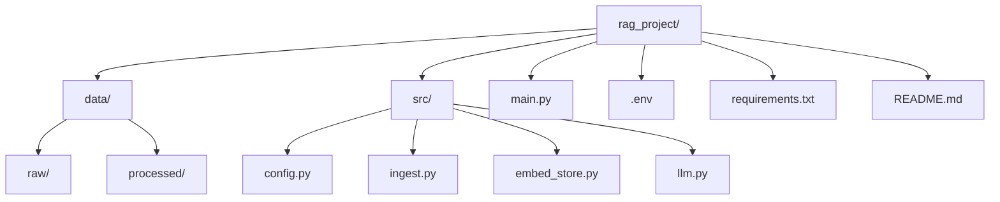

# 🚀 Enterprise-Ready RAG Pipeline

A robust, modular, and production-oriented framework for building Retrieval-Augmented Generation (RAG) applications. Designed for enterprise use cases, emphasizing configuration-driven design, cost-efficiency, and extensibility.

---

## 🧩 Overview

The pipeline:
- Ingests various document types
- Creates vector embeddings
- Stores them efficiently
- Uses a Large Language Model (LLM) to answer questions based on retrieved context

---

## ✅ Key Features

- **Modular Design:** Each logical step (ingest, embed, retrieve, generate) is separated into its own module for easy testing, maintenance, and upgrades.
- **Configuration-Driven:** All settings (API keys, model names, file paths, chunking parameters) are managed in a central `config.py` file.
- **Cost-Conscious & Efficient:**
  - **Checksum Verification:** Detects file changes, preventing redundant processing.
  - **Persistent Vector Store:** Embeddings are calculated once and saved to disk (using ChromaDB).
- **Multi-Format Document Support:** Supports PDF (`.pdf`), Microsoft Word (`.docx`), and Plain Text (`.txt`) files.
- **Command-Line Interface (CLI):** Separates indexing from querying, mirroring production workflows.
- **Modern LangChain Implementation:** Uses LangChain Expression Language (LCEL) for building a transparent and powerful RAG chain.

---

## 📂 Project Structure



- **data/**
  - `raw/` — Place your source documents (`.pdf`, `.docx`, `.txt`) here
  - `processed/` — Caches processed chunks and file checksums
- **src/**
  - `config.py` — Central configuration for the entire pipeline
  - `ingest.py` — Handles document loading, chunking, and checksums
  - `embed_store.py` — Manages the ChromaDB vector store
  - `llm.py` — Initializes the LLM (e.g., Groq)
- `main.py` — Main entry point with the CLI (index, query)
- `.env` — Stores secret API keys (Git-ignored)
- `requirements.txt` — Project dependencies
- `README.md` — You are here!

---

## 🚀 Getting Started

Follow these steps to set up and run the project locally.

### 1. Clone the Repository

```bash
git clone <your-repository-url>
cd rag_project
```

### 2. Set Up Environment Variables

Create a file named `.env` in the project's root directory. This file stores your secret API keys.

**.env file:**
```env
OPENAI_API_KEY="sk-..."
GROQ_API_KEY="gsk_..."
```
> **Note:**  
> - `OPENAI_API_KEY` is required for generating embeddings  
> - `GROQ_API_KEY` is used for the LLM

### 3. Install Dependencies

Install all required Python packages using `requirements.txt`. It's recommended to use a virtual environment.

```bash
# Create and activate a virtual environment (optional)
python -m venv venv
source venv/bin/activate  # On Windows, use `venv\Scripts\activate`

# Install dependencies
pip install -r requirements.txt
```

### 4. Add Your Documents

Place your source files in the `data/raw/` directory. Supported formats: `.pdf`, `.docx`, `.txt`.

### 5. Index a Document

Use the CLI to index a document:

```bash
python -m src.main index --file advanced-rag-interview-prep.pdf
```

This will ingest, chunk, and embed the document, storing results in the vector store.

### 6. Query the System

Ask questions using the CLI:

```bash
python -m src.main query "What is Retrieval-Augmented Generation?"
```

The system will retrieve relevant chunks and generate an answer using the LLM.

---

## ⚙️ Usage

Operate the application via the command-line interface in `main.py`.

### Step 1: Index a Document

Reads the file, splits it into chunks, generates embeddings, and saves them to the local vector store.

```bash
python main.py index --file "my_document.pdf"
```
> Run once for each new or updated file. The system skips indexing if the file hasn't changed.

### Step 2: Query Your Documents

Once your documents are indexed, you can ask questions using the `query` command. Retrieve relevant information and generate concise answers.

```bash
python main.py query "What was the main conclusion of the report?"
```

**Another example:**
```bash
python main.py query "Summarize the key points from the final chapter."
```

---

## 🛠️ Troubleshooting

- Ensure your `.env` file contains valid API keys.
- If you change a document, re-run the `index` command to update the vector store.
- If you see errors about missing vector store, run `index` first.
- For GPU acceleration, ensure PyTorch is installed with CUDA support.

---

## 🤝 Contributing

Contributions are welcome! Please:
- Fork the repository
- Create a feature branch
- Submit a pull request with a clear description
- Ensure your code is well-documented and tested

---

## 📚 References

- [LangChain](https://python.langchain.com/)
- [ChromaDB](https://www.trychroma.com/)
- [Groq](https://groq.com/)

---

## 📄 License

This project is licensed under the MIT License.
